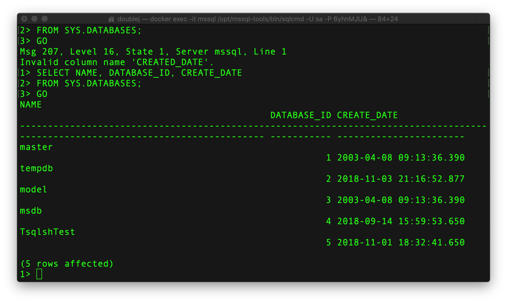
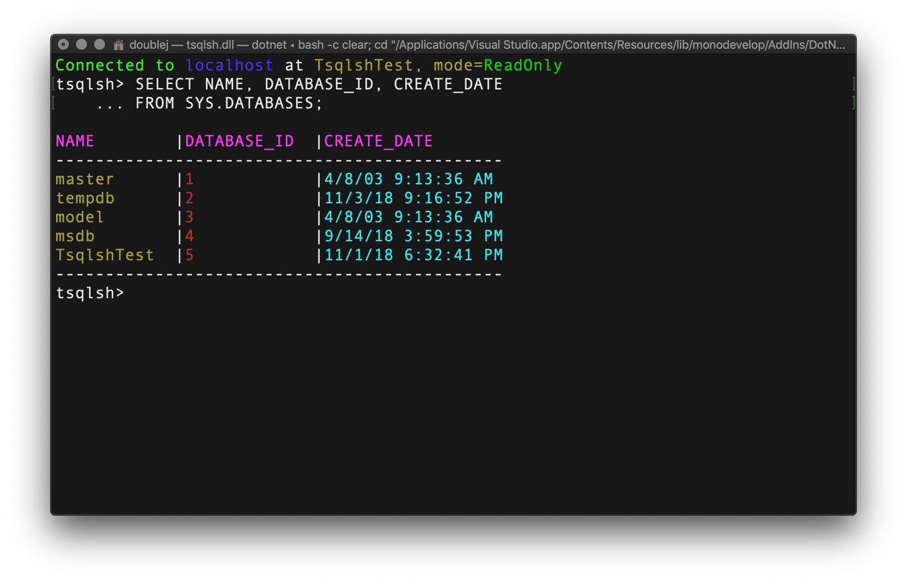

# tsqlsh

A cqlsh-inspired cli for MSSQL on a Mac (and Linux in the future)

---
## Update 2018-11-18
I've created a feature branch where I'm working on unit testing.  This started out as a RnD project and unit testing was not a big concern.  Now I'v decided to use it as an opportunity to get familiar with Xunit.  I still have a lot of unit tests to write; probably some more refactoring to make it easier to test closer to the data access boundary.  My general rule of thumb is that if it can't be unit tested, you may need to revisit the design or imo=plementation.  There are exceptions to the this rule of course; each situation has to be evaluated in it's own unique context.

## Reasons Why

### Stay On Top of .Net Core

Because I need a "practical" project to get familiar with .Net Core.  I've been using C# and .Net since its second Beta since late 2001.  I've seen the evolution of the framework in a production environment up through Framework 4.6.1.

In the past two years I've started branching out and began using other languages such as Go (_I simply LOVE working with Go_) and Node.js. But I need to keep the C# skills up-to-date.  Besides, C# 7.0 and onwards has introduced features that be used to similar effect as in Go.  For example, how [tuples](https://docs.microsoft.com/en-us/dotnet/csharp/tuples) can be used to return multiple results, or how 7.0 introduced [discards](https://docs.microsoft.com/en-us/dotnet/csharp/discards).

### Keep SQL Server Skills Sharp

I've been using SQL Server Since MSSQL 2000.  Even though in my current job we're migrating to NoSQL stores (Cassandra, S3, Redis, Elasticsearch)  We still have production data running on SQL Server 2017.  While I am enjoying the new approaches and technologes with NoSQL data stores, I want to keep my trusty old TSQL skill sharp.

### I Like Working with cqlsh

Because of the new technologies I've transitioned to using the terminal way more than I ever did under Windows.  I've grown to prefer using the terminal.  It makes me feel smart; like a real nerd.  I use cqlsh regularly and thought that making my own cli for MSSQL that mimicked cqlsh would make for a fun project.  Hence the name 'tsqlsh'.

## Current State

Right now it's still very much a raw project.  Some of the basic functionality works but it needs _a lot_ of polishing.  By no means should this be considered a usable solution for interacting SQL Server.

## Example

Here is a screenshot of sqlcmd:

Here is the same command ran in tsqlsh:

Much nicer output, don't you think?

---

## Help Is Welcomed

### Prerequisite Tools

* Visual Studio 2017 Community (Profession and up is OK)
* _(preferred)_Your workstation is a Mac
* Docker CE
* [microsoft/mssql-server Docker image](https://hub.docker.com/r/microsoft/mssql-server/) for a MSSQL server instance to test against.  Yes, there are other ways to have a MSSQL server, but let's be consistent.  Besides, Sql Server on Ubuntu; whooda thunkit???  That's pretty cool!

### Prerequisite Skills
  
* A solid knowledge of C#
* Fastidious code engineer
  * hates compiler and linting warnings
  * hates complicated code
  * Loves to write comments and unit tests.
* Must love cats.  Yes; cats.
* A familiarity with Cassandra and more importantly cqlsh is very helpful.
